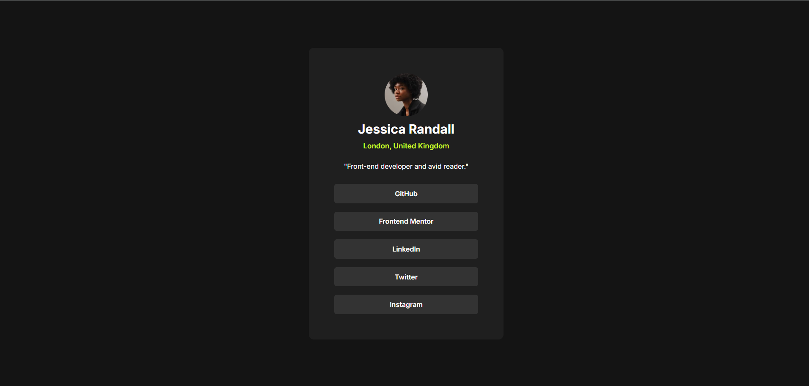

# Frontend Mentor - Social links profile solution

This is a solution to the [Social links profile challenge on Frontend Mentor](https://www.frontendmentor.io/challenges/social-links-profile-UG32l9m6dQ).

## Table of contents

- [Overview](#overview)
  - [Screenshot](#screenshot)
  - [Links](#links)
- [My process](#my-process)
  - [Built with](#built-with)
  - [What I learned](#what-i-learned)
  - [Continued development](#continued-development)
- [Author](#author)

## Overview

### Screenshot



### Links

- [Solution](https://www.frontendmentor.io/solutions/social-link-profile---mobile-responsive-c536L_2amG)
- [Live](https://social-link-profile-sable.vercel.app/)

## My process

### Built with

- Semantic HTML5 markup
- CSS custom properties
- Flexbox
- Mobile-first workflow

### What I learned

First time implementing a hover state that changes both background color and text color simultaneously using CSS nesting:

```css
li:hover {
    background-color: var(--green);
    & a {
        color: var(--grey-700);
    }
}
```

Made the entire `<li>` clickable (not just the text) by moving padding from `li` to the `<a>` tag and setting `display: block` on the anchor so it fills the full button area:

```css
li {
    padding: 0;
}

li a {
    display: block;
    padding: .8em;
    width: 100%;
    text-align: center;
}
```

Used `width: min(23em, 95%)` for responsive container sizing without a media query.

### Continued development

- Add smooth hover transitions using `transition` property — current hover is instant, a subtle `200ms ease` would feel more polished
- Practice focus states for keyboard navigation accessibility
- Explore CSS nesting further as a modern alternative to BEM-style selectors

## Author

- Frontend Mentor - [@bangarukondabollapally](https://www.frontendmentor.io/profile/bangarukondabollapally)
- GitHub - [@bangarukondabollapally](https://github.com/bangarukondabollapally)